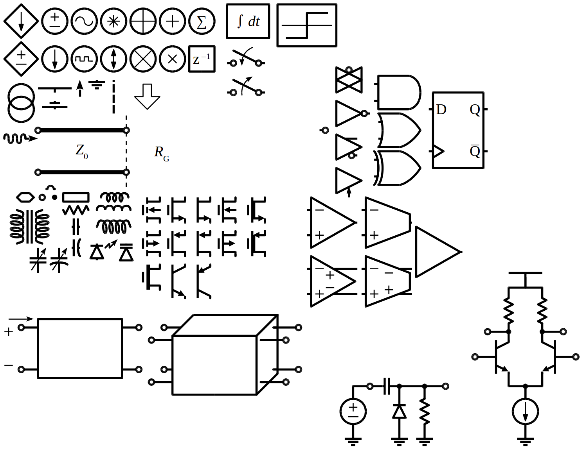

<!-- Reference-style links to make tables & lists more readable -->
[OpenOffice]: <https://www.openoffice.org>
[LibreOffice]: <https://www.libreoffice.org>
[Inkscape]: <https://inkscape.org>
[inkscapeCircuitSymbols]: <https://github.com/fsmMLK/inkscapeCircuitSymbols>
[inkscapeLogicGates]: <https://github.com/fsmMLK/inkscapeLogicGates>

# ElectricalDiagrams: Publication-quality circuit schematics

## Description
This repository provides symbol libraries to generate electrical/electronic circuit schematics. The libraries are stored in simple .odg (Open Document Graphic) files, which are compatible with programs supporting the Open Document Format (ODF) standard (ex: [OpenOffice], [LibreOffice]).

## :warning: More advanced alternative
A more advanced alternative with even higher quality, configurable symbols is available in the form of an [Inkscape] plugin. I do not know the author, but I like the approach taken:

 - [inkscapeCircuitSymbols &#x21AA;][inkscapeCircuitSymbols]: Analog components (`R`, `L`, `C`, transistors, sources, etc).
 - [inkscapeLogicGates &#x21AA;][inkscapeLogicGates]: A seperate plugin, for some reason.
 - Also annotates the symbols (voltage, current flow, etc).
 - Issue: &#x1F615; Symbols are large relative to typical use case in a document (default scale). Is it possible to make them smaller by default?

## Libraries

### [Symbols\_Electrical.odg](Symbols_Electrical.odg)

## Suggested Configuration

### LibreOffice 4.2

To ease the process of positionning & connecting schematic symbols, it is highly suggested you modify the grid settings by following these steps:

 1. Create a new drawing.
 1. In `Tools|Options...|LibreOffice Draw|General`:
    - Set `Unit of measurement` = `Millimeter`.

 1. In `Tools|Options...|LibreOffice Draw|Grid`:
    - Select `Snap to grid` & `Visible grid`.
    - Set `Resolution` (H&V) = 10mm (coarse resolution).
    - Set `Subdivision` (H&V) = 5 (Target: 2mm fine resolution).
    - `Snap` &rArr; Select nothing.
    - `Snap position` &rArr; Only check `When rotating` - set to 90deg.

 1. In Format|Styles and Formatting:
    - Right-click on `Default` & click on `Modify`.
    - Set `Width` = 1mm.
